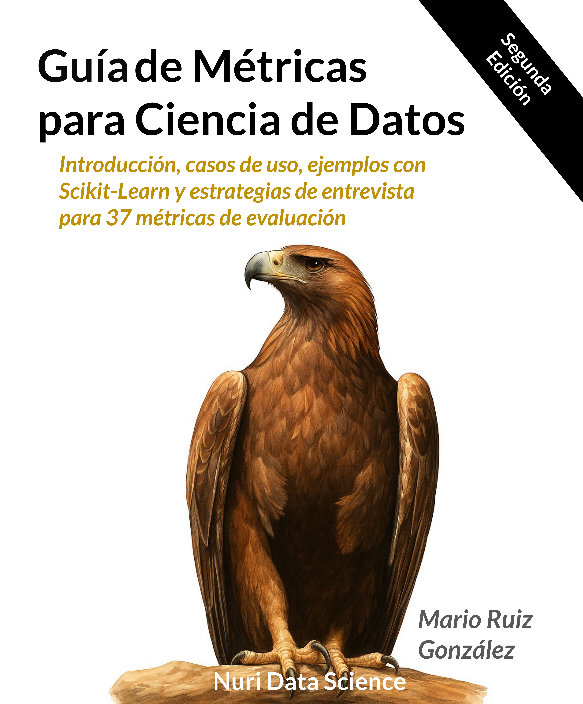

  

# Guía de Métricas para Ciencia de Datos – Segunda Edición

La **Guía de Métricas para Ciencia de Datos** es un compendio técnico que explica, con ejemplos prácticos y casos reales, las **37 métricas más relevantes para evaluar modelos de Machine Learning**.  
Diseñada para científicos de datos, analistas y aspirantes que desean dominar la evaluación de modelos, esta segunda edición combina teoría, código y estrategia de entrevistas.

---

## Qué encontrarás

- Explicaciones claras y aplicadas de cada métrica  
- Ejemplos en **Python y Scikit-Learn**  
- Contexto de uso según el tipo de problema (clasificación, regresión, clustering, etc.)  
- Guías para **responder preguntas técnicas en entrevistas**  
- Enfoque interpretativo y didáctico, sin exceso de notación matemática  

---

## Objetivo

Ayudar a los profesionales de ciencia de datos a **entender, elegir y explicar con criterio técnico** las métricas que realmente importan.

---

## Estructura del contenido

Cada métrica incluye:

- Definición conceptual  
- Aplicación práctica con código  
- Interpretación de resultados  
- Errores comunes y recomendaciones  
- Respuesta modelo para entrevistas  

---

## Autor

**Mario Ruiz**  
Científico de datos y fundador de [NURI Data Science](https://nuridatascience.com), una plataforma educativa enfocada en formar profesionales capaces de pensar con criterio analítico y técnico.  
Con más de trece años de experiencia en tecnología, combina su conocimiento en programación, estadística y machine learning para enseñar desde la práctica y no desde la teoría.

